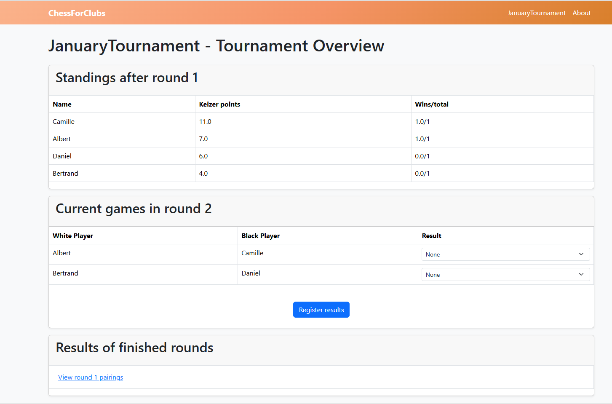

# ChessForClubs

**Simple chess club tournament management website**

- create tournaments
- add players
- make pairings
- register results...

## Screenshot


## Setup & Run Commands

```bash
python -m pip install -r requirements.txt

python manage.py collectstatic
python manage.py makemigrations
python manage.py migrate
python manage.py createsuperuser

gunicorn --bind 0.0.0.0:8000 ChessForClubs.wsgi:application --workers 5 --log-level debug
```
